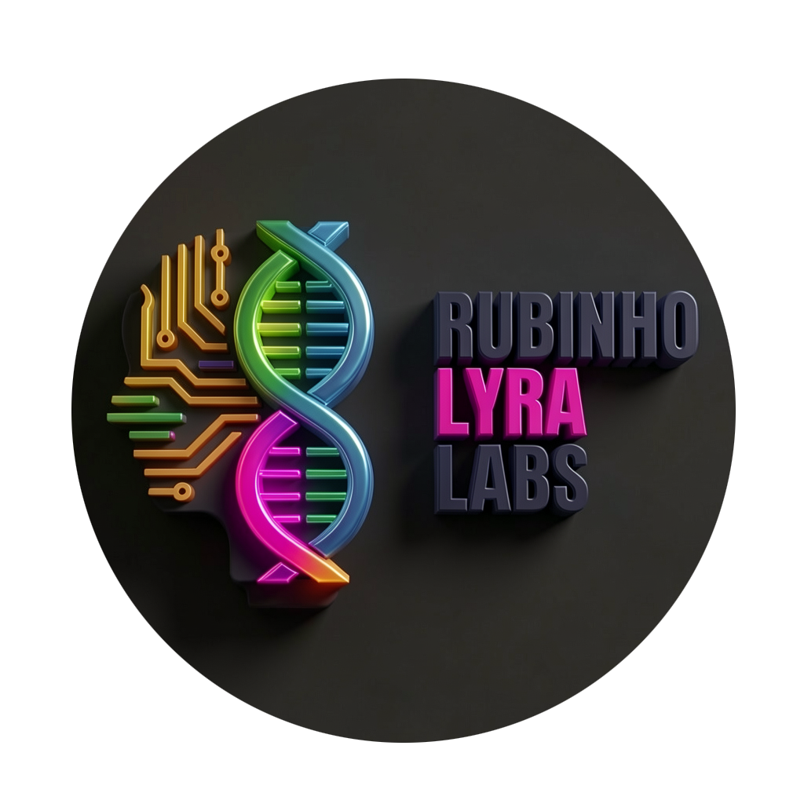
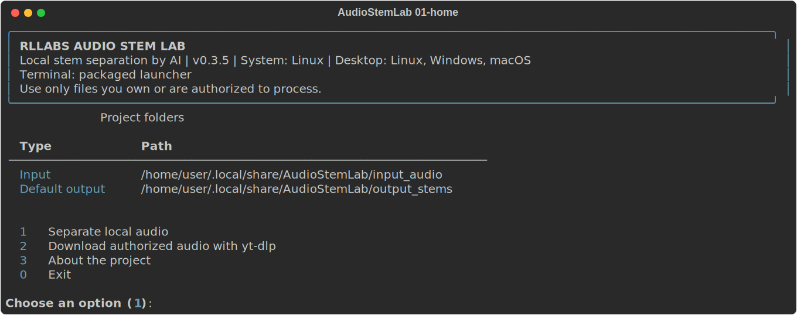
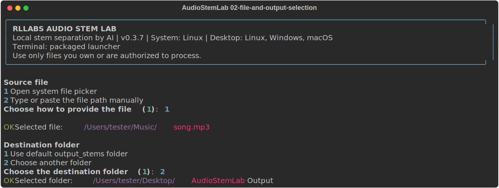
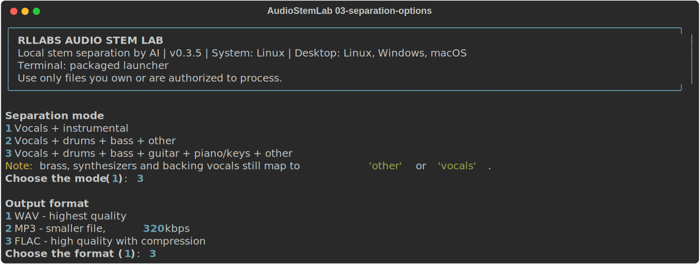
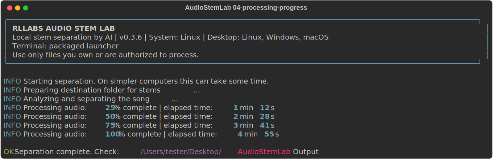
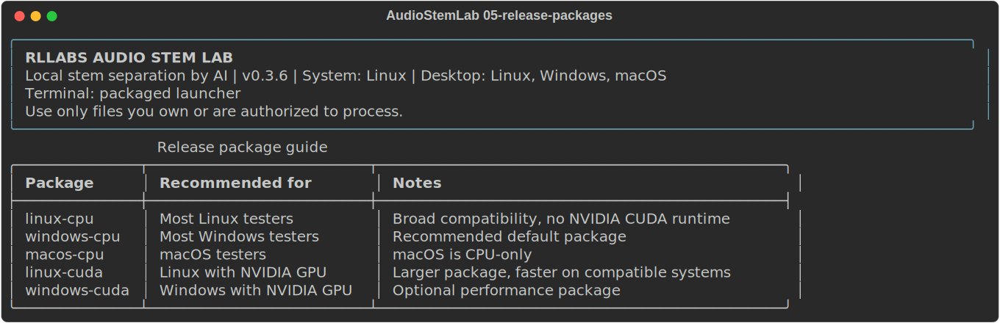

<p align="center">
  
</p>

<h1 align="center">RLLABS Audio Stem Lab</h1>

<p align="center">
  Local AI-powered audio stem separation packaged for desktop testers.
</p>

<p align="center">
  
  
  
  
</p>

<p align="center">
  
  
  
</p>

---

## Overview

**RLLABS Audio Stem Lab** is a local application for separating audio tracks into stems using AI models. The current release is still a terminal-based MVP, but the project is already structured to evolve into an installable and portable desktop application.

The project prioritizes:

- local execution;
- a simple experience for testers;
- clear input and output organization;
- future compatibility with Linux, Windows, and macOS;
- technical care around the real limits of source separation models.

## Release Status

| Item | Status |
| --- | --- |
| Current version | `0.3.6` |
| Interface | Assisted terminal |
| Target platforms | Linux, Windows, and macOS |
| Mobile | Not available yet |
| Main separator | Demucs |
| Desktop build | Portable PyInstaller packages |

## Download For Testers

End users should download the ready-to-run package for their operating system from the project release page.

The release packages are generated as:

```text
AudioStemLab-v0.3.6-linux-cpu.zip
AudioStemLab-v0.3.6-windows-cpu.zip
AudioStemLab-v0.3.6-macos-cpu.zip
AudioStemLab-v0.3.6-linux-cuda.zip
AudioStemLab-v0.3.6-windows-cuda.zip
```

The portable package includes the application runtime. Testers do **not** need to install Python, create a virtual environment, or run `pip`.

Note: the current test package includes the runtime and application files. Demucs model weights may still be downloaded on first use if they are not already available in the user's model cache.

### CPU vs CUDA Packages

The CPU package is recommended for most testers. It works on a wider range of computers and avoids shipping NVIDIA CUDA libraries.

The CUDA package is optional and intended only for Linux/Windows computers with a compatible NVIDIA GPU and driver stack. It can improve separation performance, but it is larger and is not useful on machines without NVIDIA CUDA support.

macOS uses CPU packages only.

After extracting the ZIP:

| System | Recommended launcher |
| --- | --- |
| Linux | `launchers/audiostemlab-linux.sh` |
| Windows | `launchers/audiostemlab-windows.bat` |
| macOS | `launchers/audiostemlab-macos.command` |

## Features

- Local audio separation with Demucs.
- Native file picker for source audio selection.
- Native folder picker for output destination selection.
- Styled terminal with persistent system header.
- Cleaner progress messages for non-technical users.
- Development output folder: `output_stems/`.
- Optional `yt-dlp` download flow for authorized material.
- Fira Code v6.2 bundled as a project asset.
- Helper launchers for Linux, Windows, and macOS.
- GitHub Actions workflow to build portable packages for the three supported desktop systems.

## Application Snapshots

The tester flow is documented below and in [docs/SCREENSHOTS.md](docs/SCREENSHOTS.md).

| Home | File and output selection |
| --- | --- |
|  |  |

| Separation options | Processing progress |
| --- | --- |
|  |  |

| Release packages |
| --- |
|  |

## Separation Modes

| Mode | Model | Expected stems |
| --- | --- | --- |
| Vocals + instrumental | `htdemucs` with `--two-stems vocals` | vocals, instrumental |
| Standard separation | `htdemucs` | vocals, drums, bass, other |
| Extended separation | `htdemucs_6s` | vocals, drums, bass, guitar, piano/keys, other |

### Technical Limits

Brass, synthesizers, detailed keyboard layers, lead vocals, and backing vocals are not reliable standalone stems in the current model setup. These cases require specialized models or additional post-processing and classification steps.

## Output Formats

- WAV
- MP3 320 kbps
- FLAC

## Project Structure

```text
MVP-AudioStemLab/
├── app.py
├── core/
│   ├── file_dialogs.py
│   ├── file_manager.py
│   ├── paths.py
│   ├── separator.py
│   ├── terminal_ui.py
│   └── version.py
├── input_audio/
├── output_stems/
├── launchers/
├── packaging/
├── assets/
└── docs/
```

## User Usage

1. Download the ZIP for your operating system.
2. Extract it to a local folder.
3. Open the matching launcher for Linux, Windows, or macOS.
4. Choose `Separate local audio`.
5. Select the source file using the system file picker.
6. Choose the separation mode.
7. Choose the output format.
8. Select a destination folder or use `output_stems/`.

## Development Setup

This section is for contributors only. It is not required for end users.

Python `3.10` or `3.11` is recommended for development.

```bash
python3 -m venv .venv
source .venv/bin/activate
python -m pip install --upgrade pip wheel
pip install -r requirements.txt
pip install -r requirements-dev.txt
python app.py
```

### Local Isolated Environment For Contributors

This workspace can also use the prepared isolated environment:

```bash
source .venv311/bin/activate
python --version
python app.py
```

## Launchers

Helper launchers for platform-specific testing:

```text
launchers/audiostemlab-linux.sh
launchers/audiostemlab-linux.desktop
launchers/audiostemlab-macos.command
launchers/audiostemlab-windows.bat
```

## Portable Build

Portable release packages are built by GitHub Actions whenever a `v*` tag is pushed.

Manual local build for contributors:

```bash
source .venv/bin/activate
pip install -r requirements-build.txt
pyinstaller packaging/AudioStemLab.spec
```

The PyInstaller output is created in `dist/`. Release ZIPs are assembled in `release_dist/` by `scripts/package_release.py`.

## Font Assets

The project includes Fira Code v6.2 at:

```text
assets/fonts/fira-code/ttf/
```

The font is distributed under the SIL Open Font License 1.1. The license is available at:

```text
assets/licenses/FIRA_CODE_LICENSE
```

Actual font and ligature activation depends on the terminal or installer used by each operating system.

## Tests

```bash
source .venv311/bin/activate
python -m pytest -q
```

Expected result for the current release:

```text
7 passed
```

## Releases

- `v0.1.0`: initial CLI MVP.
- `v0.3.4`: portable release pipeline, terminal experience for testers, native pickers, Fira Code assets, and cleaner progress output.
- `v0.3.5`: split CPU and CUDA portable packages.
- `v0.3.6`: README snapshots visible on the release branch and ready-to-download release artifacts.

Full release notes:

```text
docs/releases/
```

## Short Roadmap

- Bundle or prefetch Demucs model weights for a more offline-friendly first run.
- Organize processing jobs by song.
- Save processing logs.
- Improve user-facing error messages.
- Prepare installers for each operating system.
- Reduce runtime weight with a CPU-only build path.
- Evolve into a complete desktop interface.

## About Rubens Lyra Labs

Rubens Lyra Labs produces applied technical content for developers and technology professionals, covering C#, .NET, ASP.NET Core, React, TypeScript, data analysis, applied artificial intelligence, automation, and software architecture.

Website: [rubinholyra.com.br](https://rubinholyra.com.br/)

## License

This project is licensed under the MIT License. See [LICENSE](LICENSE).
